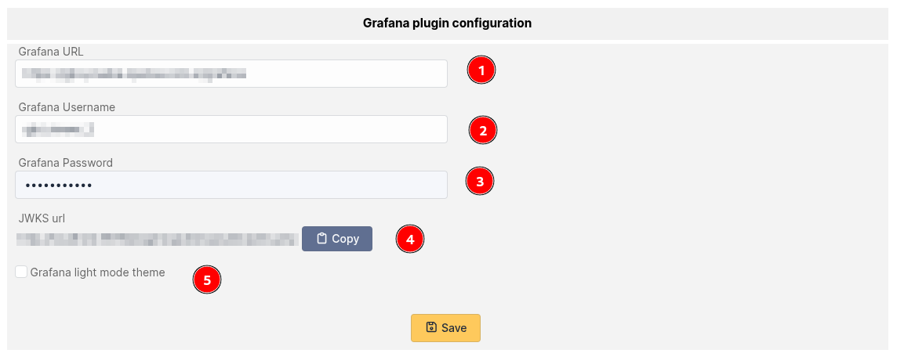
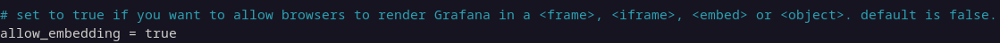
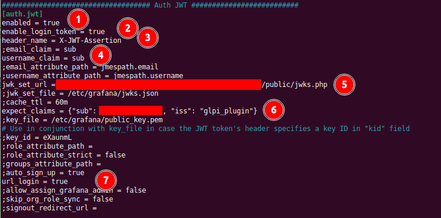
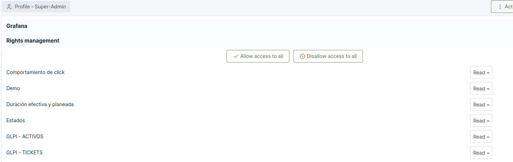
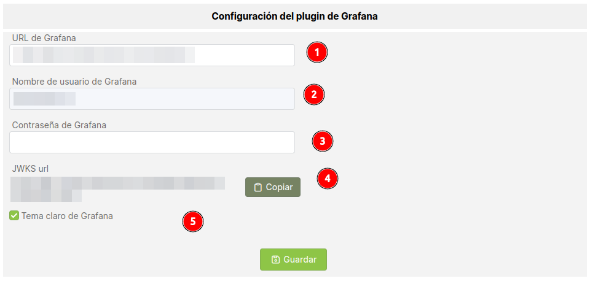
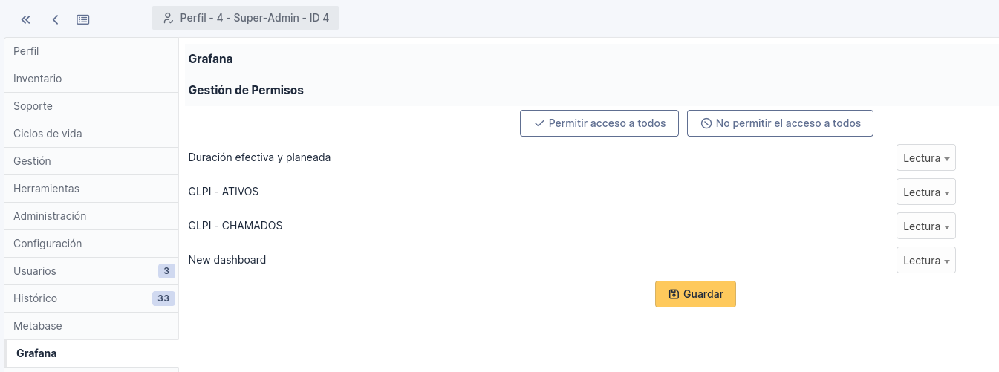

## English version 

# Grafana integration with GLPI

This plugin is a modified version of the [GLPI metabase plugin](https://github.com/pluginsGLPI/metabase) that allows you to embed Grafana dashboards directly into GLPI.

## Plugin configuration

### GLPI configuration

On the plugin's configuration page, you will need to provide the following information:

<ol>
  <li><b>Grafana URL:</b> The URL of the Grafana server you want to connect to.</li>
  <li>& 3. <b>Grafana Credentials:</b> The <b>username</b> and <b>password</b> of a Grafana user. The plugin will use this account to connect to the API, retrieve the list of dashboards, and authenticate users to view them inside GLPI. You can control which dashboards are available by limiting this user's access within Grafana.</li>
  <li value="4"><b>JWKS URL:</b> This URL is required later when you configure authentication in Grafana.</li>
  <li><b>Use Light Theme:</b> Check this box to make the plugin use Grafana's light theme instead of the default dark theme.</li>
</ol>

### Grafana server configuration

You'll need to modify the following parameters in your grafana.ini file.

Most parameters are self-explanatory, but here are a few key points:
- Note that the **allow_embedding** option is not in the same configuration block as the other options.
5. **Login URL:** Use the **JWKS URL** provided by the Grafana plugin in the previous section (point 4).
6. **"sub" Parameter:** This must match the **username** you entered in the plugin configuration (point 2).

### Permissions configuration

Once everything is configured correctly, you can define which dashboards a user profile can see from the **Profiles** configuration page in GLPI.

## Español

Este plugin es una versión modificada del [plugin de Metabase para GLPI](https://github.com/pluginsGLPI/metabase) que permite incrustar paneles de Grafana directamente en GLPI.

## Configuración del plugin

### Configuración en GLPI

En la página de configuración del plugin dentro de GLPI, necesitarás proporcionar la siguiente información:

<ol>
  <li><b>URL de Grafana:</b>La URL del servidor de Grafana al que deseas conectarte.</li>
  <li>& 3.<b>Credenciales de Grafana:</b>El <b>nombre de usuario</b> y la <b>contraseña</b> de un usuario de Grafana. El plugin utilizará esta cuenta para conectarse a la API, obtener la lista de paneles y autenticar a los usuarios para que puedan verlos dentro de GLPI. Se puede controlar qué paneles aparecen limitando los permisos de este usuario directamente en Grafana.</li>
  <li value="4"><b>URL del JWKS:</b>Esta URL será necesaria más adelante cuando configures la autenticación en Grafana.</li>
  <li><b>Usar Tema Claro:</b>Marcar esta casilla para que el plugin utilice el tema claro de Grafana en lugar del tema oscuro por defecto.</li>
</ol>

### Configuración del servidor Grafana

A continuación, se deben modificar los siguientes parámetros en tu archivo grafana.ini.

  

La mayoría de los parámetros son autoexplicativos, algunas notas:
- Tener en cuenta que la opción **allow_embedding** no se encuentra en el mismo bloque de configuración que las demás.
5. **url_login:** Utiliza la URL proporcionada por el plugin en la sección anterior (punto 4).
6. **parámetro sub:** Debe coincidir con el **nombre de usuario** que ingresaste en la configuración del plugin (punto 2).  

### Configuración de permisos

Una vez que todo esté configurado correctamente, se puede definir qué paneles puede ver cada perfil de usuario desde la página de configuración de **Perfiles** en GLPI.

