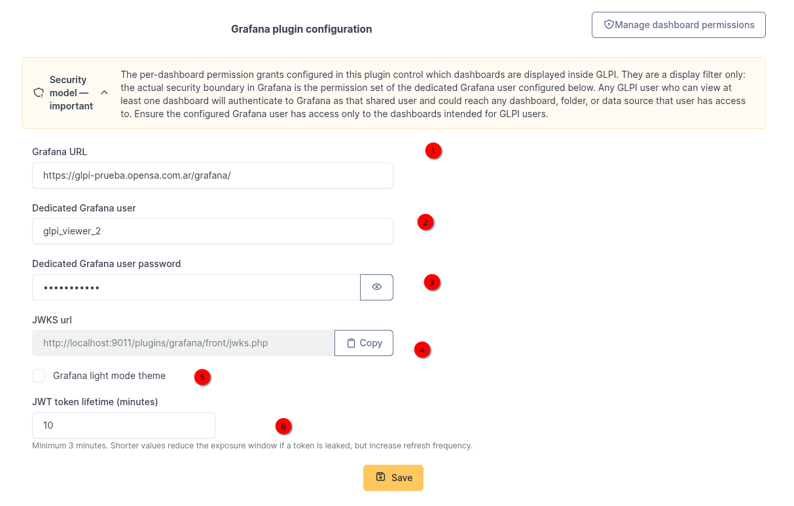
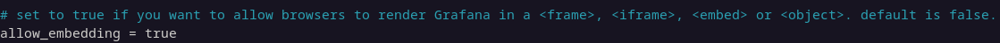
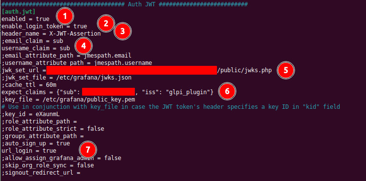
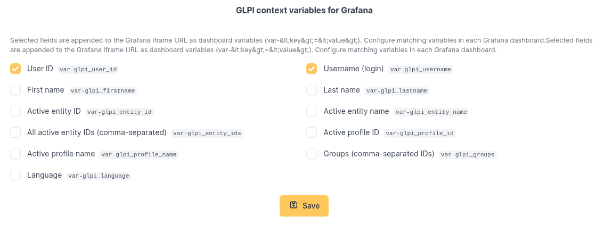
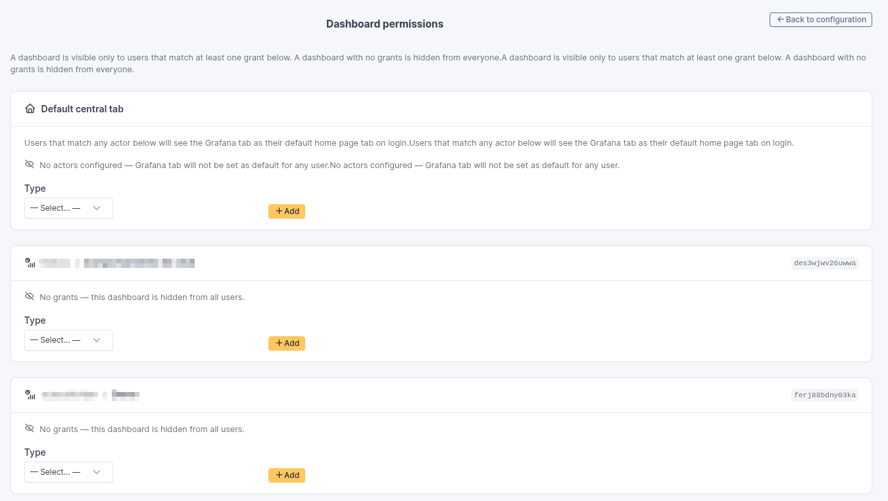
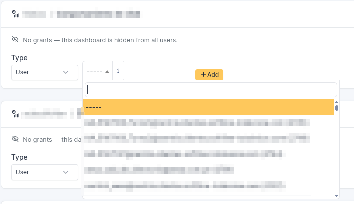
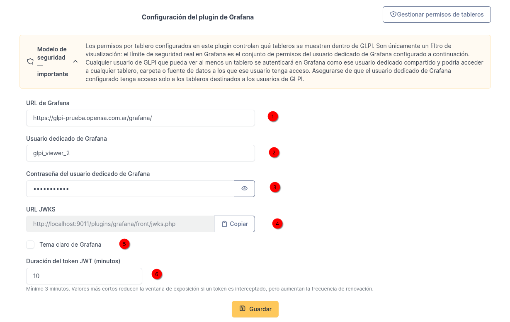
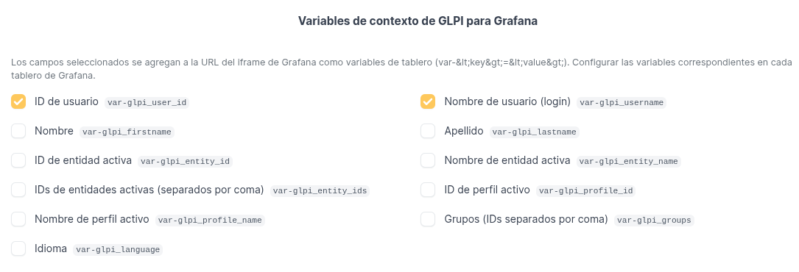
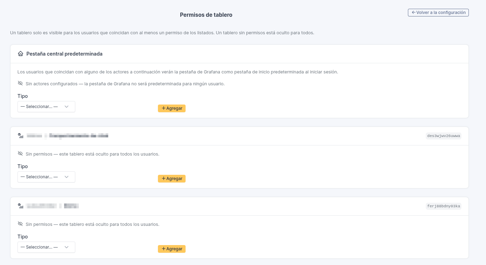
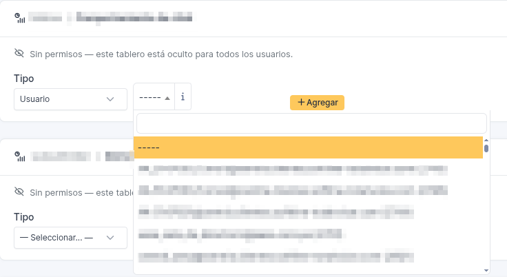

# Latest releases

| ------        | GLPI 11 | GLPI 10 |
|-------------|----------|----------|
| **Download**| [1.1.2](https://github.com/Open-SA/grafana/releases/tag/1.1.2)   | [1.0.2](https://github.com/Open-SA/grafana/releases/tag/1.0.2)   |
| **Branch** | main    | support/glpi10  |
| **Status** | Latest  | Supported |

## English version

# Grafana integration with GLPI

This plugin is a modified version of the [GLPI metabase plugin](https://github.com/pluginsGLPI/metabase) that allows you to embed Grafana dashboards directly into GLPI.

## Requirements

- GLPI 11.x (for GLPI 10.x support, see the `support/glpi10` branch)
- PHP 8.2+
- A Grafana instance accessible from the GLPI server

## Installation

1. Download the latest release zip from the [Releases page](../../releases).
2. Extract the `grafana` folder into `<glpi_root>/plugins/`.
3. In GLPI: **Setup > Plugins**, find Grafana and click **Install**, then **Enable**.

## Features

- Embed Grafana dashboards directly inside GLPI
- Granular permissions: assign dashboard access per user, group, profile, or entity
- Forward GLPI session data to Grafana as URL variables (user, entity, profile, groups, language)
- Set a default dashboard tab per profile or user
- Dashboard tree view with folder support

## Plugin configuration

### GLPI configuration

On the plugin's configuration page, you will need to provide the following information:



<ol>
  <li><b>Grafana URL:</b> The URL of the Grafana server you want to connect to.</li>
  <li>& 3. <b>Grafana Credentials:</b> The <b>username</b> and <b>password</b> of a Grafana user. The plugin will use this account to connect to the API, retrieve the list of dashboards, and authenticate users to view them inside GLPI. You can control which dashboards are available by limiting this user's access within Grafana.</li>
  <li value="4"><b>JWKS URL:</b> This URL is required later when you configure authentication in Grafana.</li>
  <li><b>Use Light Theme:</b> Check this box to make the plugin use Grafana's light theme instead of the default dark theme.</li>
  <li><b>Token lifetime:</b> Duration in minutes of the JWT token used to authenticate with Grafana. Default is 10 minutes; minimum is 3 minutes. The plugin refreshes the token automatically 2 minutes before it expires, so the minimum useful value is 3 minutes. Shorter lifetimes reduce the exposure window if a token is intercepted from a URL or log.</li>
</ol>

### Grafana server configuration

You'll need to modify the following parameters in your grafana.ini file.




Most parameters are self-explanatory, but here are a few key points:
- Note that the **allow_embedding** option is not in the same configuration block as the other options.
5. **Login URL:** Use the **JWKS URL** provided by the Grafana plugin in the previous section (point 4).
6. **"sub" Parameter:** This must match the **username** you entered in the plugin configuration (point 2).

**JWT claims:** The plugin includes an `aud` (audience) claim set to your Grafana URL, and a `jti` (JWT ID) claim with a unique random value per token. Grafana ignores `aud` unless you explicitly enforce it; to do so, add the following to your `[auth.jwt]` section in `grafana.ini`:

```ini
expect_claims = {"aud": "https://your-grafana-url"}
```

The `jti` claim is currently unused by Grafana and is included for forward compatibility.

**Recommendation — strip auth_token from logs:** The JWT is passed as a URL parameter (`?auth_token=…`), so it may appear in your Grafana reverse proxy's access logs. To prevent this, configure your proxy to redact or omit that parameter from logs. Example for nginx:

```nginx
# Custom log format that strips the auth_token query parameter
log_format grafana_safe '$remote_addr - $remote_user [$time_local] '
                        '"$request_method $uri" $status $body_bytes_sent';
# Use this format for the Grafana upstream's access_log directive
```

For Apache, use a `CustomLog` directive with a format string that logs `%U` (URI path without query string) instead of `%r`.

**About the `kid` (key ID):** The plugin derives the `kid` header automatically from a hash of its current public key, so it changes on its own whenever the key pair is regenerated (e.g. after a reinstall, or by rotating the keys from the config page — see [Key rotation](#key-rotation) below). Do not set `key_id` or `key_file` manually in your `grafana.ini` — the plugin relies on `jwk_set_url` to publish its key dynamically, and a static `key_id`/`key_file` would conflict with that and stop working the next time the key rotates.

**JWKS troubleshooting:** If Grafana logs show `failed to verify JWT: EOF` or a similar JWKS-related error, check the following:
- **The JWKS URL must be reachable directly from Grafana's server**, not just from your browser. Test it from the Grafana host itself:
  ```bash
  curl -v https://your-glpi-url/plugins/grafana/front/jwks.php
  ```
  It should return `200` with a JSON body like `{"keys": [...]}`. A redirect (`3xx`) or an HTML page instead of JSON usually means something in front of GLPI is blocking the request.
- **If your GLPI instance uses SSO/SAML**, make sure `front/jwks.php` is explicitly excluded from the forced-login redirect. SSO integrations commonly intercept every unauthenticated request by default; since Grafana's server (not a logged-in browser) is the one requesting this endpoint, it needs to reach it without triggering an SSO login flow.
- If the URL responds correctly but authentication still fails with a signature error, restart Grafana so it re-fetches the JWKS — it caches the response for a while.

### Session variables

The plugin can forward GLPI session data to Grafana dashboards as URL variables (`var-*`). This allows Grafana to filter or personalize dashboards based on the logged-in user's context.

On the configuration page, enable the variables you want to forward:



Available variables:

| Variable | Description |
|---|---|
| `var-glpi_user_id` | User ID |
| `var-glpi_username` | Username (login) |
| `var-glpi_firstname` | First name |
| `var-glpi_lastname` | Last name |
| `var-glpi_entity_id` | Active entity ID |
| `var-glpi_entity_name` | Active entity name |
| `var-glpi_entity_ids` | All active entity IDs (comma-separated) |
| `var-glpi_profile_id` | Active profile ID |
| `var-glpi_profile_name` | Active profile name |
| `var-glpi_groups` | Groups (comma-separated IDs) |
| `var-glpi_language` | Language |

To use them in Grafana, create dashboard variables with the same names (without the `var-` prefix).

### Permissions configuration

Once everything is configured, click the **Permissions** button on the plugin configuration page to open the permissions management page.

From there you can assign dashboard access individually to users, groups, profiles, or entities. Each entry lets you select which specific dashboards are visible.




### Key rotation

The **Action(s)** section of the config page includes a **Rotate signing keys now** button. Clicking it generates a fresh RSA key pair and immediately invalidates every unused token — the `kid` served by the JWKS endpoint changes automatically along with it, so there's nothing else to configure on the Grafana side.

Rotation does **not** necessarily end sessions already established in Grafana: if `enable_login_token` is enabled in your `grafana.ini`, users who already exchanged their JWT for a Grafana session cookie keep working normally until that session expires on its own — rotation only affects tokens that haven't been used yet.

### Security model

> **Important:** The per-dashboard grants described above are a **display filter inside GLPI only**. The real security boundary in Grafana is the permission set of the dedicated Grafana user configured in the plugin.
>
> Any GLPI user who holds at least one dashboard grant will authenticate to Grafana as that shared dedicated user. From Grafana's perspective, all of them are the same user, and they can potentially access any dashboard, folder, or data source that dedicated user can reach — not just the ones granted in GLPI.
>
> To reduce the exposure surface, configure the dedicated Grafana user with the minimum permissions it needs: grant it access only to the folders and dashboards you intend to show inside GLPI, and nothing else.

---

## Español

Este plugin es una versión modificada del [plugin de Metabase para GLPI](https://github.com/pluginsGLPI/metabase) que permite incrustar paneles de Grafana directamente en GLPI.

## Requisitos

- GLPI 11.x (para soporte de GLPI 10.x, ver la rama `support/glpi10`)
- PHP 8.2+
- Una instancia de Grafana accesible desde el servidor de GLPI

## Instalación

1. Descargar el zip de la última versión desde la [página de Releases](../../releases).
2. Extraer la carpeta `grafana` dentro de `<raiz_glpi>/plugins/`.
3. En GLPI: **Configuración > Complementos**, buscar Grafana y hacer clic en **Instalar**, luego en **Activar**.

## Funcionalidades

- Incrustar paneles de Grafana directamente dentro de GLPI
- Permisos granulares: asignar acceso a paneles por usuario, grupo, perfil o entidad
- Enviar datos de sesión de GLPI a Grafana como variables de URL (usuario, entidad, perfil, grupos, idioma)
- Establecer un panel por defecto por perfil o usuario
- Vista de árbol de paneles con soporte de carpetas

## Configuración del plugin

### Configuración en GLPI

En la página de configuración del plugin dentro de GLPI, necesitarás proporcionar la siguiente información:



<ol>
  <li><b>URL de Grafana:</b> La URL del servidor de Grafana al que deseas conectarte.</li>
  <li>& 3. <b>Credenciales de Grafana:</b> El <b>nombre de usuario</b> y la <b>contraseña</b> de un usuario de Grafana. El plugin utilizará esta cuenta para conectarse a la API, obtener la lista de paneles y autenticar a los usuarios para que puedan verlos dentro de GLPI. Se puede controlar qué paneles aparecen limitando los permisos de este usuario directamente en Grafana.</li>
  <li value="4"><b>URL del JWKS:</b> Esta URL será necesaria más adelante cuando configures la autenticación en Grafana.</li>
  <li><b>Usar Tema Claro:</b> Marcar esta casilla para que el plugin utilice el tema claro de Grafana en lugar del tema oscuro por defecto.</li>
  <li><b>Duración del token:</b> Duración en minutos del token JWT utilizado para autenticarse con Grafana. El valor por defecto es 10 minutos; el mínimo es 3 minutos. El plugin renueva el token automáticamente 2 minutos antes de que expire, por lo que el valor mínimo útil es 3 minutos. Tiempos más cortos reducen la ventana de exposición si un token es interceptado desde una URL o un log.</li>
</ol>

### Configuración del servidor Grafana

A continuación, se deben modificar los siguientes parámetros en tu archivo grafana.ini.


La mayoría de los parámetros son autoexplicativos, algunas notas:
- Tener en cuenta que la opción **allow_embedding** no se encuentra en el mismo bloque de configuración que las demás.
5. **url_login:** Utiliza la URL proporcionada por el plugin en la sección anterior (punto 4).
6. **parámetro sub:** Debe coincidir con el **nombre de usuario** que ingresaste en la configuración del plugin (punto 2).

**Claims JWT:** El plugin incluye un claim `aud` (audience) con la URL de Grafana, y un claim `jti` (JWT ID) con un valor aleatorio único por token. Grafana ignora el `aud` a menos que se configure explícitamente; para forzarlo, agregar lo siguiente a la sección `[auth.jwt]` del `grafana.ini`:

```ini
expect_claims = {"aud": "https://tu-url-de-grafana"}
```

El claim `jti` no es utilizado actualmente por Grafana y se incluye por compatibilidad futura.

**Recomendación — limpiar auth_token de los logs:** El JWT se envía como parámetro de URL (`?auth_token=…`), por lo que puede aparecer en los logs de acceso del reverse proxy de Grafana. Para evitarlo, configurar el proxy para redactar u omitir ese parámetro de los logs. Ejemplo para nginx:

```nginx
# Formato de log personalizado que omite el query string
log_format grafana_safe '$remote_addr - $remote_user [$time_local] '
                        '"$request_method $uri" $status $body_bytes_sent';
# Usar este formato en la directiva access_log del upstream de Grafana
```

Para Apache, usar una directiva `CustomLog` con un formato que registre `%U` (ruta sin query string) en lugar de `%r`.

**Sobre el `kid` (key ID):** El plugin deriva el header `kid` automáticamente a partir de un hash de su clave pública actual, así que cambia solo cada vez que se regenera el par de claves (por ejemplo, después de un reinstall, o rotando las claves desde la página de configuración — ver [Rotación de claves](#rotación-de-claves) más abajo). No configures `key_id` ni `key_file` manualmente en tu `grafana.ini` — el plugin depende de `jwk_set_url` para publicar su clave de forma dinámica, y un `key_id`/`key_file` estático entraría en conflicto con eso y dejaría de funcionar la próxima vez que rote la clave.

**Troubleshooting de JWKS:** Si los logs de Grafana muestran `failed to verify JWT: EOF` o un error similar relacionado al JWKS, revisá lo siguiente:
- **La URL del JWKS tiene que ser alcanzable directamente desde el servidor de Grafana**, no solo desde tu navegador. Probala desde el propio host de Grafana:
  ```bash
  curl -v https://tu-url-de-glpi/plugins/grafana/front/jwks.php
  ```
  Debería devolver `200` con un body JSON tipo `{"keys": [...]}`. Un redirect (`3xx`) o una página HTML en vez de JSON usualmente significa que algo delante de GLPI está bloqueando la request.
- **Si tu instancia de GLPI usa SSO/SAML**, asegurate de excluir explícitamente `front/jwks.php` del redirect de login forzado. Las integraciones de SSO suelen interceptar por defecto cualquier request sin sesión; como quien pide este endpoint es el servidor de Grafana (no un navegador logueado), necesita poder alcanzarlo sin disparar el flujo de login de SSO.
- Si la URL responde bien pero la autenticación sigue fallando con un error de firma, reiniciá Grafana para que vuelva a pedir el JWKS — lo cachea por un tiempo.

### Variables de sesión

El plugin puede enviar datos de la sesión de GLPI a los paneles de Grafana como variables de URL (`var-*`). Esto permite que Grafana filtre o personalice los paneles según el contexto del usuario conectado.

En la página de configuración, activar las variables que se quieran enviar:



Variables disponibles:

| Variable | Descripción |
|---|---|
| `var-glpi_user_id` | ID de usuario |
| `var-glpi_username` | Nombre de usuario (login) |
| `var-glpi_firstname` | Nombre |
| `var-glpi_lastname` | Apellido |
| `var-glpi_entity_id` | ID de entidad activa |
| `var-glpi_entity_name` | Nombre de entidad activa |
| `var-glpi_entity_ids` | Todos los IDs de entidades activas (separados por coma) |
| `var-glpi_profile_id` | ID de perfil activo |
| `var-glpi_profile_name` | Nombre de perfil activo |
| `var-glpi_groups` | Grupos (IDs separados por coma) |
| `var-glpi_language` | Idioma |

Para usarlas en Grafana, crear variables de dashboard con los mismos nombres (sin el prefijo `var-`).

### Configuración de permisos

Una vez configurado todo, hacer clic en el botón **Permisos** de la página de configuración del plugin para abrir la página de gestión de permisos.

Desde ahí se puede asignar acceso a paneles individualmente a usuarios, grupos, perfiles o entidades. Cada entrada permite seleccionar qué paneles específicos son visibles.




### Rotación de claves

La sección **Acción(es)** de la página de configuración incluye un botón **Rotar las claves de firma ahora**. Al hacer clic se genera un nuevo par de claves RSA y se invalida inmediatamente todo token no utilizado — el `kid` que sirve el endpoint JWKS cambia automáticamente junto con él, así que no hay nada más que configurar del lado de Grafana.

La rotación **no** necesariamente termina las sesiones ya establecidas en Grafana: si `enable_login_token` está activo en tu `grafana.ini`, los usuarios que ya intercambiaron su JWT por una cookie de sesión de Grafana siguen funcionando normalmente hasta que esa sesión expire por su cuenta — la rotación solo afecta a los tokens que todavía no se usaron.

### Modelo de seguridad

> **Importante:** Los permisos por panel descritos arriba son únicamente un **filtro de visualización dentro de GLPI**. El límite de seguridad real en Grafana es el conjunto de permisos del usuario dedicado de Grafana configurado en el plugin.
>
> Cualquier usuario de GLPI que tenga al menos un permiso de panel se autenticará en Grafana como ese usuario dedicado compartido. Desde el punto de vista de Grafana, todos son el mismo usuario, y potencialmente pueden acceder a cualquier panel, carpeta o fuente de datos a los que ese usuario tenga acceso — no solo los habilitados en GLPI.
>
> Para reducir la exposición, configurar el usuario dedicado de Grafana con los permisos mínimos necesarios: otorgarle acceso solo a las carpetas y paneles que se quieran mostrar dentro de GLPI, y nada más.
